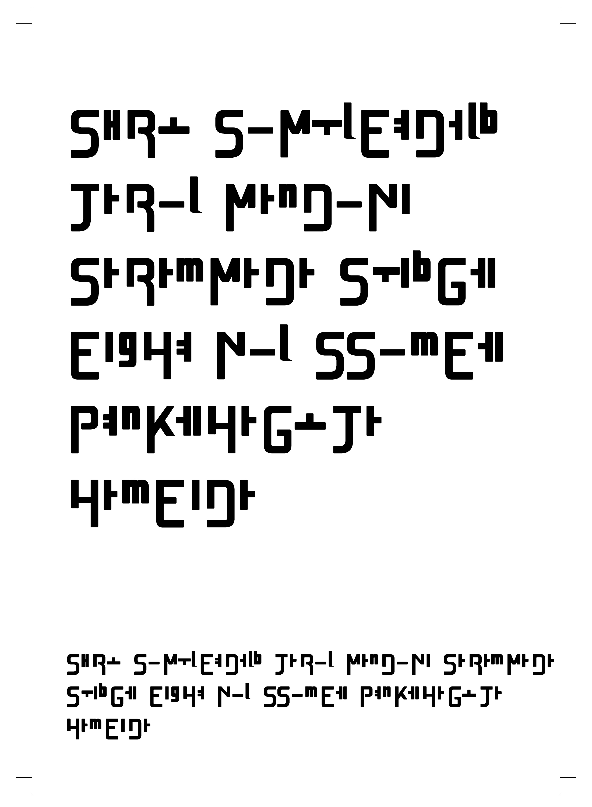
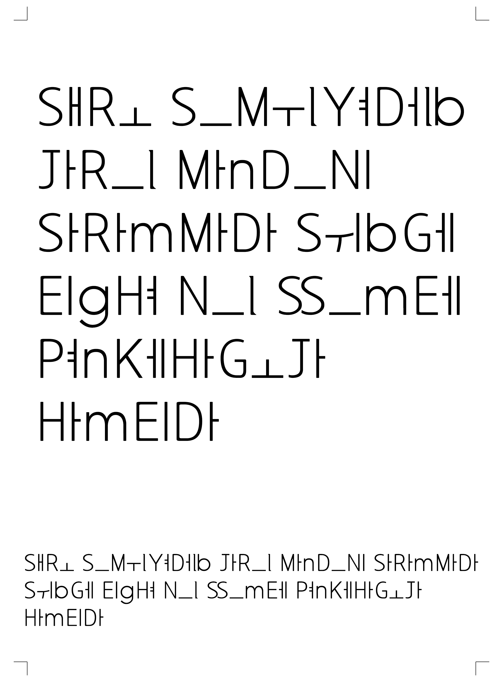

# DEJAVU:H Typeface

## Download

👉 https://github.com/dejavuvideo/dejavuh-font/releases/latest

- DEJAVUH-Regular.ttf
- DEJAVUH-Bold.ttf

  
All rights to this typeface are exclusively owned by Kwangkee Lee.

A typeface that builds Hangul through a unique Latin-based structural system.
DEJAVU:H is an original typeface that applies a systematic composition method combining Latin consonants and Hangul vowels.
This typeface is an original work created by Kwangkee Lee and is not related to the DejaVu font project.

Copyright (c) 2026 Kwangkee Lee. All rights reserved.

## License

This font is free for personal and non-commercial use only.

Commercial use (including branding, logos, printed materials, digital content, and merchandise) requires prior permission or a separate license from the author.

Use of this font as a primary visual or conceptual element in artworks, exhibitions, or artistic productions requires prior permission from the author.

This font and its structure are protected by copyright and design rights.  
Any derivative creation (including similar font production) based on its structure is strictly prohibited.

## Contact

For licensing inquiries:  
dejavuh.license@gmail.com

## Sample dejavuh_bold

## Sample dejavuh_regular

